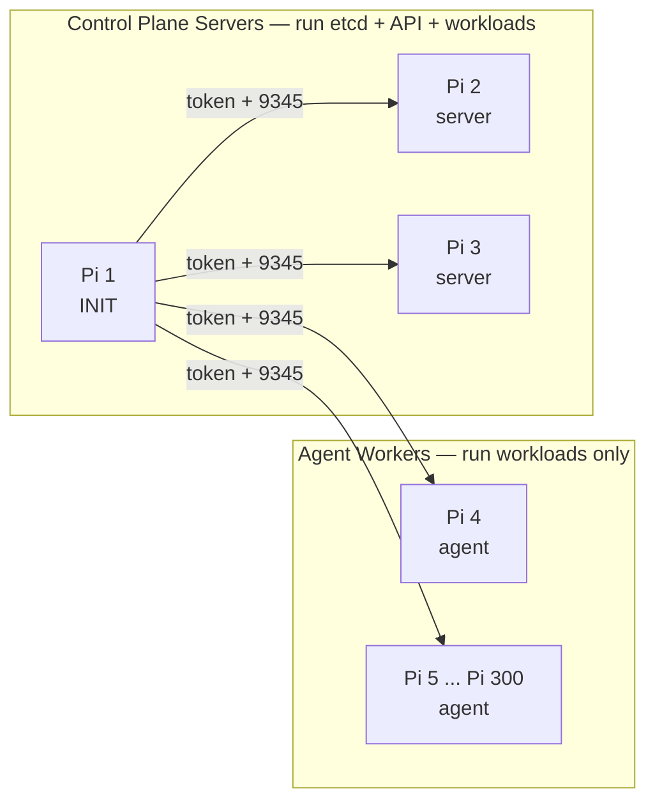
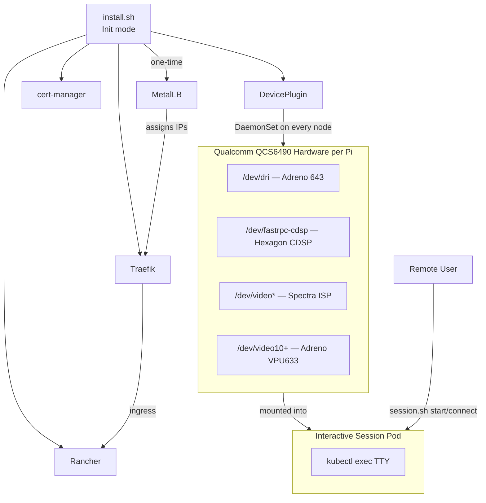

# Rubik Pi 3 — Kubernetes Auto-Installer (Multi-Node)

## Repository Structure

```
rubik-kubernetes/
├── install.sh                       # Entry point — same script, run on every Pi
├── scripts/
│   └── session.sh                   # Interactive hardware session manager
├── manifests/
│   ├── qualcomm-device-plugin.yaml  # DaemonSet: exposes GPU/NPU/ISP/VPU per node
│   ├── session-rbac.yaml            # RBAC for session pods
│   └── session-pod-template.yaml    # Reference pod template (hardware-enabled)
└── README.md
```

---

## Multi-Node Cluster Design

The same `install.sh` is run on every Pi. Its behavior is controlled by three environment variables:


| Variable         | Required on     | Description                                                                  |
| ---------------- | --------------- | ---------------------------------------------------------------------------- |
| `CLUSTER_SERVER` | Joining nodes   | `https://<first-node-ip>:9345` — absent = init mode                          |
| `CLUSTER_TOKEN`  | Joining nodes   | Shared secret printed by the first node                                      |
| `CLUSTER_ROLE`   | Optional        | `server` (default) or `agent` — controls whether node joins as control plane |
| `METALLB_RANGE`  | First node only | IP range for MetalLB, e.g. `192.168.1.200-192.168.1.220`                     |


### Usage

```bash
# Node 1 — initializes the cluster, installs all services, prints join command
sudo METALLB_RANGE="192.168.1.200-192.168.1.220" ./install.sh

# All other nodes — join as control plane servers (can also run workloads)
sudo CLUSTER_SERVER="https://192.168.1.10:9345" CLUSTER_TOKEN="abc123..." ./install.sh

# Optional: join as pure worker (no etcd, no API server)
sudo CLUSTER_SERVER="https://192.168.1.10:9345" CLUSTER_TOKEN="abc123..." CLUSTER_ROLE=agent ./install.sh
```

The init node prints the exact join command at the end, including the generated token.

---

## Node Roles in RKE2

RKE2 terminology: **server** nodes run etcd + API server + kubelet; **agent** nodes run only kubelet. Both can schedule workloads.

- **Server nodes are not tainted by default** — they run pods like any other node. No manual untainting needed.
- Recommendation: first 1–5 Pis as `server` (odd number for etcd quorum), remaining as `agent`. The script defaults all to `server`; set `CLUSTER_ROLE=agent` for pure workers.
- At 300 nodes: run 3 or 5 as servers, the rest as agents.




---

## Component Stack




---

## install.sh — Flow

### Init mode (`CLUSTER_SERVER` not set)

1. Preflight — detect node IP, install `curl`/`helm`, prompt for `METALLB_RANGE` if not set
2. Generate `CLUSTER_TOKEN` (random 32-char hex, saved to `/etc/rancher/rke2/token`)
3. Write `/etc/rancher/rke2/config.yaml`:
  - `cluster-init: true`
  - `disable: [rke2-servicelb, rke2-traefik]`
  - `tls-san: [<node-ip>]`
  - `token: <generated-token>`
4. Install + start `rke2-server`, wait for node Ready
5. Setup kubectl (`/var/lib/rancher/rke2/bin/kubectl`, KUBECONFIG in `~/.bashrc`)
6. Install **MetalLB** (Helm) → apply `IPAddressPool` + `L2Advertisement`
7. Install **Traefik** (Helm, `service.type=LoadBalancer`) → gets IP from MetalLB
8. Install **cert-manager** (Helm, `crds.enabled=true`)
9. Install **Rancher** (Helm, `hostname=rancher.<traefik-ip>.nip.io`, `ingress.ingressClassName=traefik`)
10. Apply `qualcomm-device-plugin.yaml` (DaemonSet — auto-runs on every node that joins)
11. Apply `session-rbac.yaml`
12. Print summary: Rancher URL, join command

### Join mode (`CLUSTER_SERVER` set)

1. Preflight — install `curl`
2. Write `/etc/rancher/rke2/config.yaml`:
  - `server: <CLUSTER_SERVER>`
  - `token: <CLUSTER_TOKEN>`
  - `tls-san: [<this-node-ip>]`
  - No `cluster-init`
3. If `CLUSTER_ROLE=agent`: `INSTALL_RKE2_TYPE=agent`; else `INSTALL_RKE2_TYPE=server`
4. Install + start `rke2-server` or `rke2-agent`, wait for node to appear in `kubectl get nodes`
5. Print: "Node joined successfully"

No Helm installs on join nodes — MetalLB/Traefik/Rancher/device plugin are already running in the cluster and the device plugin DaemonSet auto-schedules onto the new node.

---

## manifests/qualcomm-device-plugin.yaml

Uses `[squat/generic-device-plugin](https://github.com/squat/generic-device-plugin)` DaemonSet (runs on **every** node). Exposes:

- `rubikpi.ai/gpu` → `/dev/dri/renderD128` + `/dev/dri/card0`
- `rubikpi.ai/npu` → `/dev/fastrpc-cdsp`
- `rubikpi.ai/isp` → `/dev/video0`
- `rubikpi.ai/vpu` → `/dev/video10`

Pods request e.g. `rubikpi.ai/gpu: "1"` in resource limits and get those devices injected.

---

## Interactive Session System (`scripts/session.sh`)

- `session.sh start <username>` — creates Pod in `sessions` namespace, privileged, requests all hardware resources, pinned to a specific node via `--node` flag or round-robin; prints connect command
- `session.sh connect <username>` — `kubectl exec -n sessions -it <pod> -- bash`
- `session.sh list` — shows all running sessions (username, node, age)
- `session.sh stop <username>` — deletes the pod

Session pods mount:

- `rubikpi.ai/gpu: "1"`, `rubikpi.ai/npu: "1"` (via device plugin — schedules pod on a node that has these)
- `securityContext.privileged: true`
- hostPath: `/dev/dri`, `/dev/fastrpc-cdsp`, `/dev/video`*, `/dev/video10`

---

## Key Configuration Details

- **MetalLB range**: only set on init node; auto-suggest from detected subnet if not provided
- **Rancher hostname**: `rancher.<traefik-lb-ip>.nip.io` — zero-config DNS
- **RKE2 ARM64**: detected automatically by the installer
- **Firmware check**: script warns if `/lib/firmware/qcom/` is missing (GPU/VPU won't init without it)
- **Control plane untainted**: RKE2 server nodes have no taints by default — no extra step needed
- **etcd quorum**: script prints a warning if joining as a server would make an even number of etcd members

---

## Files to Create

- `[install.sh](install.sh)` — ~400 lines, bash, idempotent, handles init + join modes
- `[scripts/session.sh](scripts/session.sh)` — ~150 lines, session lifecycle
- `[manifests/qualcomm-device-plugin.yaml](manifests/qualcomm-device-plugin.yaml)` — DaemonSet + RBAC
- `[manifests/session-rbac.yaml](manifests/session-rbac.yaml)` — Namespace + ClusterRole
- `[README.md](README.md)` — install instructions, multi-node guide, session usage, hardware resources

